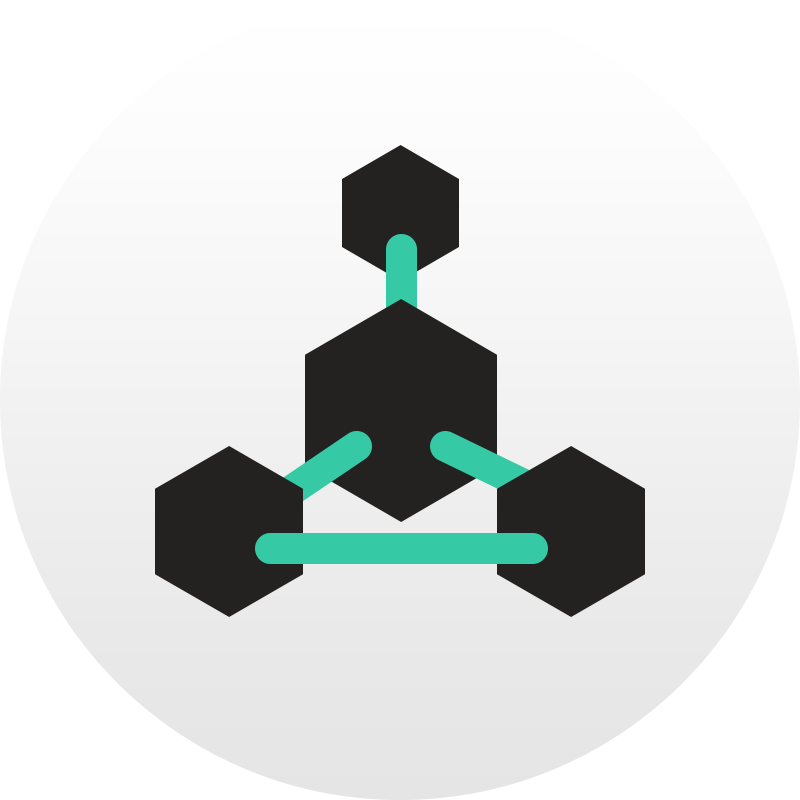

# Welcome to the Zel Ecosystem
The complete package blockchain suite that enables users to interact with crypto (and blockchain in general)
with ease.

## Zel Modules
| Logo                                                  | Module                                    | Description                                                          |
|-------------------------------------------------------|-------------------------------------------|----------------------------------------------------------------------|
| {: width=50 }           | [Zel Currency](zel/zel)                   | Onboarding & Gas for the Ecosystem                                   |
| {: width=50 }  | [ZelCore](zelcore/zelcore)                | Multi-asset wallet & platform to use the Ecosystem                   |
| {: width=50 } | [ZelNodes](zelnodes/zelnodes)             | Enterprise-grade computing hardware to underpin the Ecosystem        |
| {: width=50 }           | [ZelFlux](flux/flux)                      | Control layer to deploy secured dApps on the Ecosystem               |
| {: width=50 }    | [ZelID](zelid/zelid)                      | Navigate seamlessly and anonymously through the Ecosystem            |
| {: width=50 }  | [ZelLabs](zellabs/zellabs)                | Get proper incubation for your blockchain project with the Ecosystem |
| {: width=50 }           | [ZelFoundation](foundation/zelfoundation) | The community-controlled wing of the Ecosystem                       |

---

## Current Module Builds
| Module                                                              | Version |
|---------------------------------------------------------------------|---------|
| [Zel Daemon](https://github.com/zelcash/zelcash)                    | v4.0.3  |
| [ZelCore](https://zel.network/project/zelcore/download.html)        | v3.10.0 |
| [ZelCore Mobile](https://zel.network/project/zelcore/download.html) | v3.6.0  |
| [ZelNodes](zelnodes/zelnodes)                                       | v1.0    |
| [ZelFlux](https://github.com/zelcash/zelflux/releases)              | v1.1.0  |
| [ZelBench](https://github.com/zelcash/aptrepo)                      | v1.4.2  |
| [ZelID](https://zelid.io)                                           | v1.0    |

